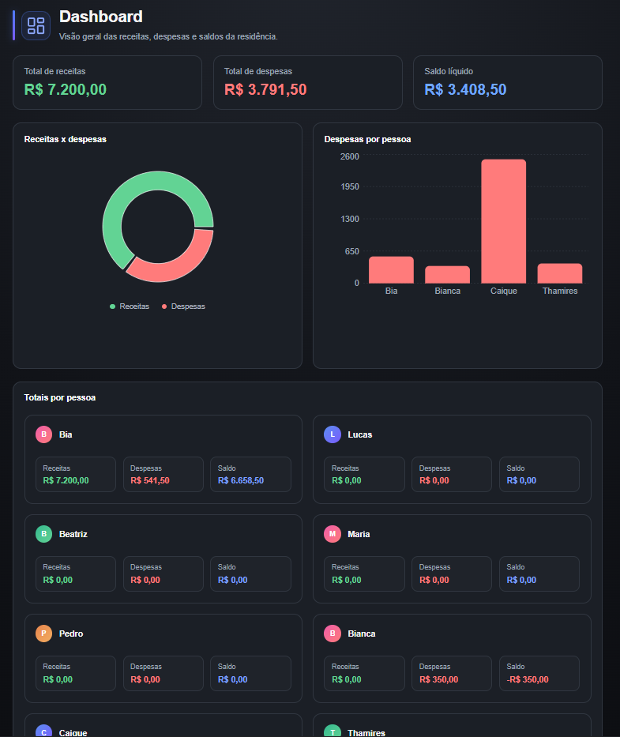
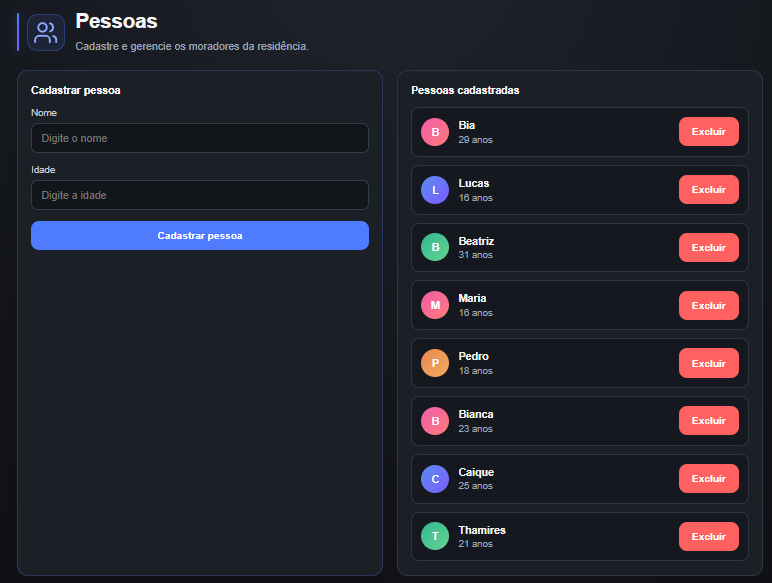
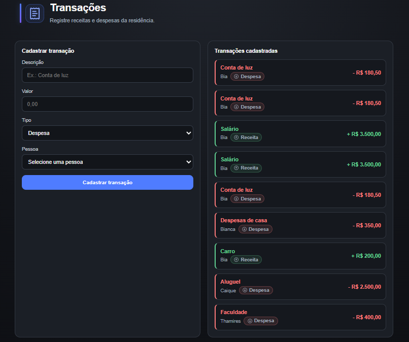

# 💰 Controle de Gastos Residenciais

Sistema web para gerenciamento financeiro de uma residência, permitindo o cadastro de moradores, receitas e despesas, além da visualização de indicadores financeiros em um dashboard moderno e intuitivo.

---

## 📸 Preview

> *(Adicione aqui prints da aplicação após a entrega.)*

| Dashboard | Pessoas |
|-----------|----------|
|  |  |

| Transações |
|------------|
|  |

---

# ✨ Funcionalidades

- 👥 Cadastro de pessoas
- 💵 Cadastro de receitas
- 💸 Cadastro de despesas
- 📊 Dashboard financeiro
- 📈 Gráfico de Receitas x Despesas
- 📉 Gráfico de Despesas por Pessoa
- 💰 Cálculo automático de saldo
- 🎨 Interface moderna e responsiva
- ⚠️ Tratamento de estados de carregamento e mensagens de erro

---

# 🛠️ Tecnologias Utilizadas

## Backend

- ASP.NET Core
- Entity Framework Core
- SQLite
- REST API
- C#

## Frontend

- React
- TypeScript
- Vite
- Recharts
- Lucide React
- CSS3

---

# 📂 Estrutura do Projeto

```text
controle-gastos-residenciais/
│
├── backend/
│   ├── Controllers
│   ├── Models
│   ├── DTOs
│   ├── Data
│   ├── Services
│   └── Program.cs
│
├── frontend/
│   ├── components
│   ├── pages
│   ├── services
│   ├── types
│   ├── utils
│   └── App.tsx
│
└── README.md
```

---

# 🚀 Como executar o projeto

## Clone o repositório

```bash
git clone https://github.com/anabfernandess/controle-gastos-residenciais.git
```

---

## Backend

```bash
cd backend
```

Instale as dependências:

```bash
dotnet restore
```

Execute:

```bash
dotnet run
```

---

## Frontend

```bash
cd frontend
```

Instale as dependências:

```bash
npm install
```

Execute:

```bash
npm run dev
```

---

# 📌 Funcionalidades do Dashboard

O dashboard apresenta indicadores financeiros em tempo real, incluindo:

- Total de receitas
- Total de despesas
- Saldo líquido
- Gráfico comparativo de receitas e despesas
- Despesas por pessoa
- Resumo financeiro individual

---

# 🎯 Objetivo

Este projeto foi desenvolvido como parte da disciplina de Engenharia de Software, com o objetivo de aplicar conceitos de desenvolvimento Full Stack, consumo de APIs REST, componentização em React e persistência de dados utilizando Entity Framework Core e SQLite.

---

# 👩‍💻 Desenvolvido por

**Ana Beatriz Fernandes**

- Engenharia de Software
- React
- TypeScript
- ASP.NET Core
- Entity Framework Core

---

## ⭐ Obrigado por visitar este projeto!

Caso tenha gostado, deixe uma ⭐ no repositório.